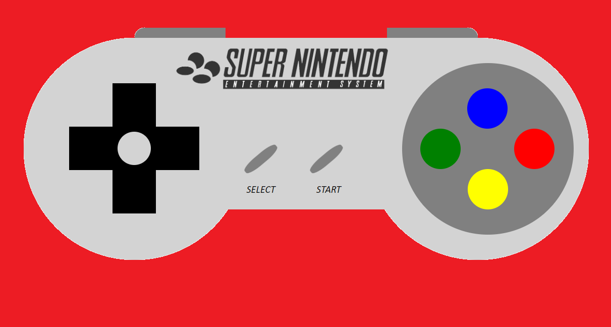

# GeeksHubs: Proyecto 01 - Videoconsola

## Indice de contenidos

1. Tecnologias usadas

2. Instalación

3. Descripción del proyecto 

4. Bugs

5. Agradecimientos 

# 1. Tecnologías usadas

    Para la realización del siguiente proyecto se han utilizado las siguientes tecnologías
* HTML5
      
* CSS3 
    

* VISUAL STUDIO CODE
    

# 2. Instalación

    Para la visualización del proyecto realizado será necesario que el usuario se remita a la página de; [GitHub](https://github.com/ManelQM/Proyecto-consola-CSS/settings/pages)

# 3. Descripción del proyecto

    Realización de el proyecto 01 - Videoconsola CSS.

    Se solicita a los inscritos en el curso de  Full Stack Developer impartido por GeeksHubs Academy (https://geekshubs.com/) 

    Se solicita a los estudiantes que construyan a través de las tecnologías HTML5 y CSS3 aplicando los conocimientos sobre los elementos y sus atributos en HTML5 así como el uso de CSS para la aplicación de hojas de estilos. 

    En el caso de este proyecto se procede a la realización de una simulación únicamente visual y no táctil o interactiva del gamepad desarrollado por la empresa Nintendo para la consola Super Famicom(JAP),Super Nes(USA/EU), Super Nintendo (ESP). 

* 

* 

# 4.Bugs/Errores

Entre los errores a destacar podríamos decir los siguientes: 

* Código; Mal uso de algunas de las propiedades hederitarias con la imposibilidad de por ejemplo mostrar el circulo alrededor de la cruceta direccional. 

* Proporcionalidad: Falta de equidistancia y harmonía de los elementos creados respecto al original debidos en gran parte a la falta de destreza adquirida por el paso del tiempo con las difererentes propiedades de los elementos. 

* Color/Imagen: Se observan diferentes carencias a la hora de aplicar las propiedades de los diferentes juegos de colores y luces ofrecidos por la tecnología utilizada. 

# 5. Agradecimientos

Muchas gracias a: 

Compañeros y profesorado del Bootcamp FSD 22/23

A mis amigos

A mis padres 

